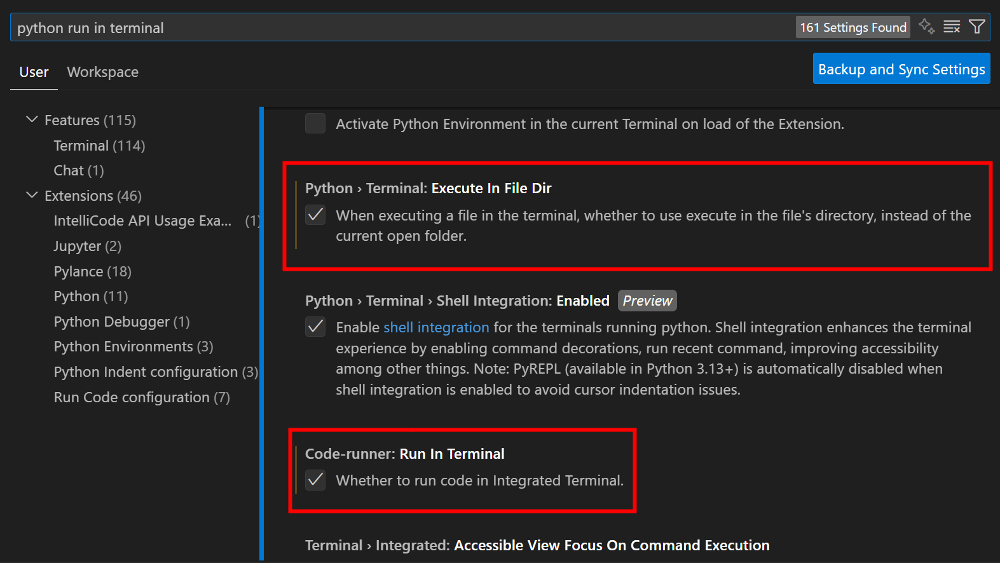

# Módulo 1: Sintaxis de Python y POO

**Versiones:** 
- Python 3.13

## Fundamentos básicos
- **Introducción** al lenguaje Python y su ecosistema
- **Instalación** y **configuración** del entorno de desarrollo
- **Tipos de datos** primitivos y **variables**
- **Operadores** aritméticos, lógicos y de comparación

## Estructuras de control
- Estructuras **condicionales** (if, elif, else)
- Estructuras **iterativas** (for, while)
- **Control de flujo** y buenas prácticas

## Funciones y manejo de errores
- Definición y uso de **funciones**
- **Parámetros**, **argumentos** y **valores de retorno**
- Manejo de **excepciones** con try/except

## Estructuras de datos
- **Listas**: creación, manipulación y métodos
- **Tuplas**: inmutabilidad y casos de uso
- **Diccionarios**: manejo de pares clave-valor
- **Conjuntos**: operaciones matemáticas de conjuntos
- **Comprehensions**: sintaxis avanzada para crear estructuras

## Programación Orientada a Objetos
- **Clases y objetos**: conceptos fundamentales
- **Encapsulación**: atributos y métodos privados
- **Herencia**: reutilización y extensión de código
- **Polimorfismo**: flexibilidad en el diseño
- **Composición**: alternativa a la herencia

## Flujo de estudio recomendado:

* Tener una carpeta en el escritorio o cualquier otro sitio personal donde abrir visual studio code y escribir archivos de python

* Clonar el repositorio de clase: https://github.com/certidevs/curso-2025-09-python-m1

Por tanto la idea sería tener dos visual studio code abiertos a la vez, uno con la carpeta propia personal de cada uno donde se crean y editan archivos, y otro con el repositorio de clase solo para consulta.

## Visual Studio Code

- Code Runner
- vscode icons
- Python Extension Pack
- Python Debugger
- Python
- Pylance
- Python Environments

A mayores:

- GitLens
- Git Graph
- GitHub Copilot (Asistente de IA)

Configuración de VSCode: 

* File > Auto Save: Activar guardado automático, para que guarde cambios en archivos.

Crear cuenta:

* github.com: alansastre

## Proyectos

Proyectos grupales de 4-5 personas en el que se desarrolla un proyecto python fastapi con base de datos con Visual Studio Code y Git-GitHub. Mentorizados.

## PERMITIR INPUT EN LA TERMINAL CON CODE RUNNER

1. File > Preferences > Settings (Archivo > Preferencias > Configuración)
2. Buscar "python run in terminal"
3. Marcar la opción "Python > Terminal: Execute In File Dir"
4. Marcar la opción "Code-runner: Run In Terminal"

## JUPYTER NOTEBOOK

Cuadernos para ejecutar celdas de python cada una con su propio resultado.

Ideal para ciencia de datos y para aprender código python.

Google Colab con cuenta de Gmail: https://colab.research.google.com/ 

## PLATAFORMAS DE PRÁCTICA

* codewars
* leetcode
* hackerrank

## REPASO

* Funciones
    * Reutilizar bloques de código: def
    * Sin parámetros: def hola()
    * Con parámetros: def hola(nombre, apellido)
    * Sin retorno: no devuelve nada
    * Con retorno: return
    * Ejemplos:
        * login
        * login con número máximo de intentos

* Estructuras de datos:
    * variable almacena un dato
    * una estructura de datos almacena varios datos
    * listas: [] (la más interesante de aprender)
        * [], list()
        * append()
        * remove()
        * ...
    * tuplas: (,) inmutables, recuperar datos para lectura
    * diccionarios: {:,:}
    * conjuntos: {}

Ejercicios:
    * 