# GIT Y GITHUB

## Cómo crear un repositorio

### Desde local a GitHub

1. Crear una carpeta en el explorador de archivos (mejor en una carpeta del disco C)
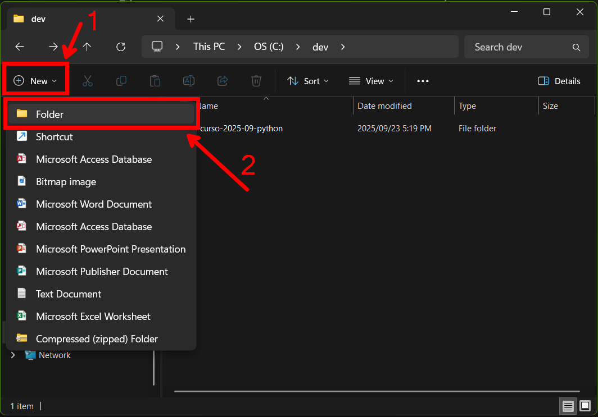

2. En Visual Studio Code, File > Open folder (Archivo > Abrir carpeta)
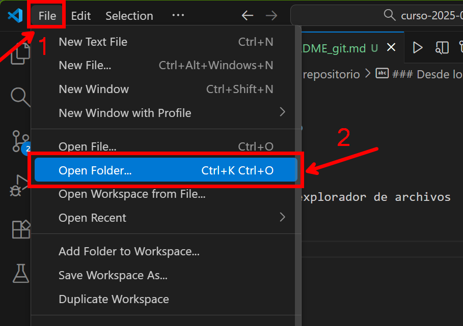

3. Seleccionar la carpeta que se usará como repositorio
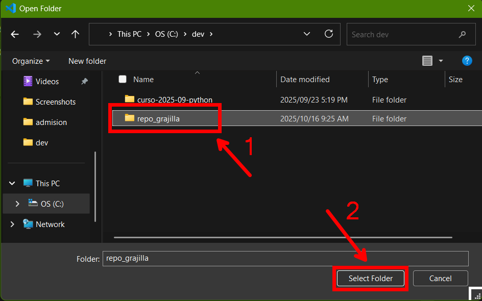

4. Una vez abierto, irse a la pestaña de Control de Versiones en la barra lateral (debes tener Git instalado)
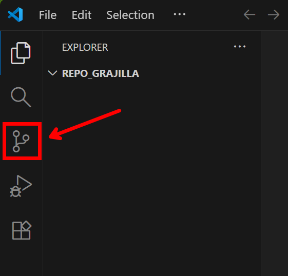

5. Se hace click en "Initialize Repository" (Inicializar Repositorio)
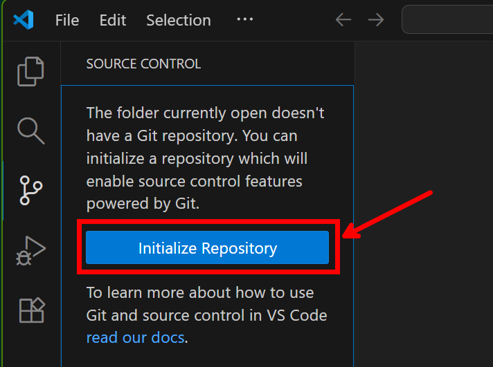

6. Una vez inicializado, darle a "Publish Branch" (Publicar Rama)
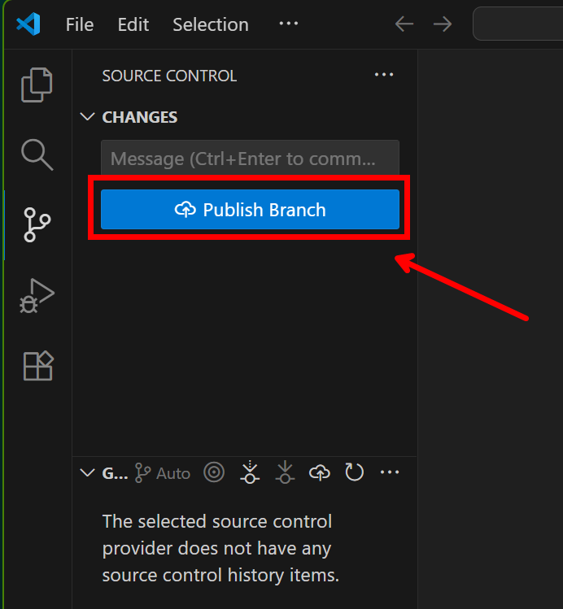

7. Permitir iniciar sesión en GitHub, darle a "Allow"
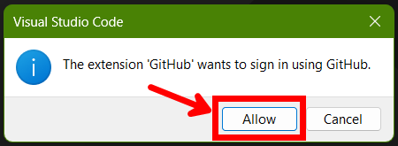

8. Le damos a "Continue" (Continuar) y a "Authorize Visual Studio Code" (Autorizar Visual Studio Code)
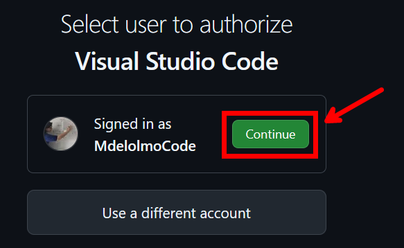
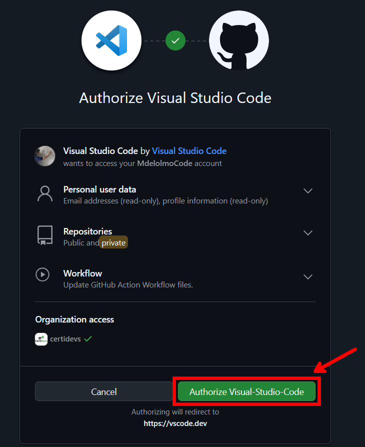

A veces tienes que volver a iniciar sesión, se da a "Confirm" (Confirmar)
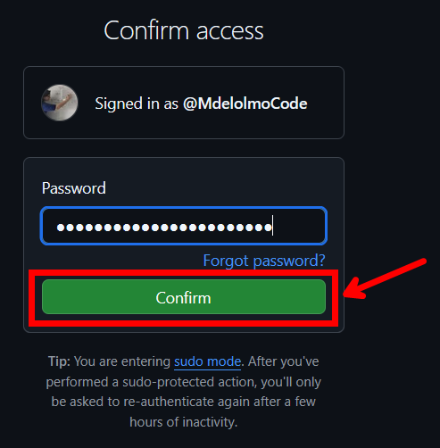

9. Le damos a "Open Link" (Abrir Enlace) y se nos abrirá Visual Studio Code
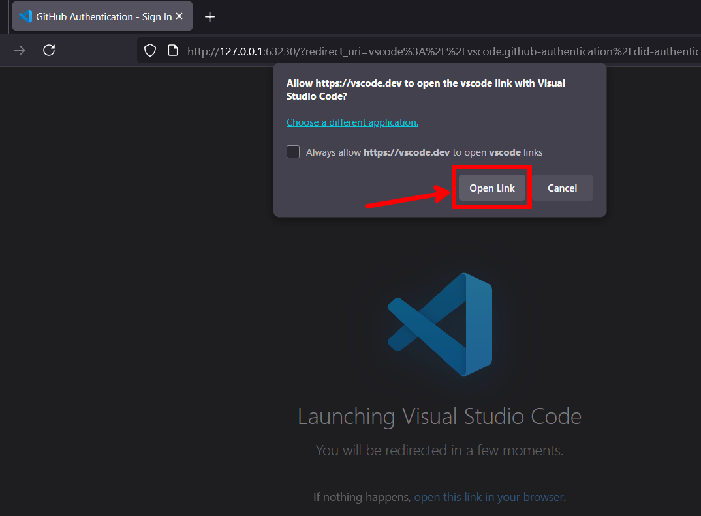

10. Se elige si el repositorio es público (visible para todo el mundo) o privado (visible sólo para ti y la gente que elijas). Elegimos PÚBLICO
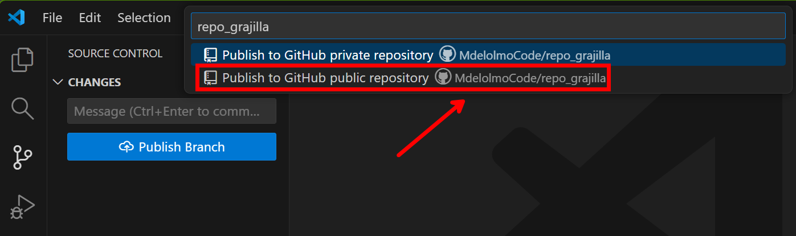

11. Si sale este error, darle a cancelar
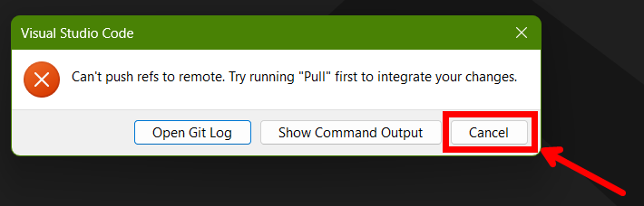

12. Comprobar si se ha subido el repositorio a tu cuenta de GitHub
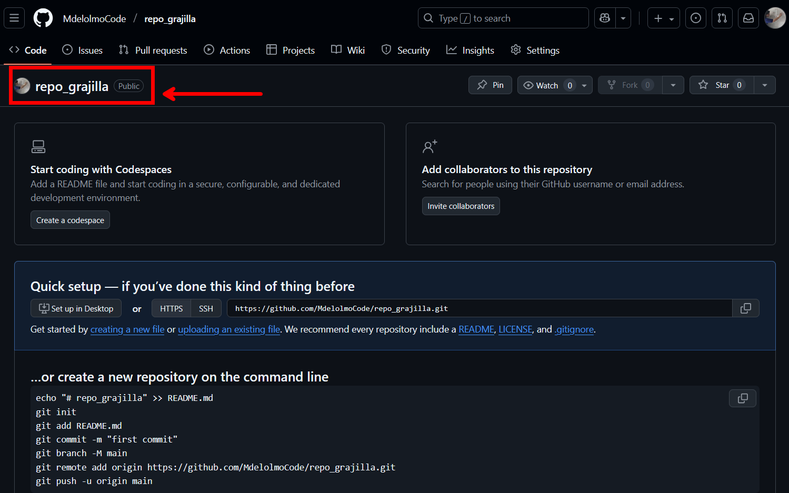