# GIT Y GITHUB

## Cómo crear un repositorio

### Desde local a GitHub

1. Crear una carpeta en el explorador de archivos (mejor en una carpeta del disco C)

2. En Visual Studio Code, File > Open folder (Archivo > Abrir carpeta)

3. Seleccionar la carpeta que se usará como repositorio

4. Una vez abierto, irse a la pestaña de Control de Versiones en la barra lateral (debes tener Git instalado)

5. Se hace click en "Initialize Repository" (Inicializar Repositorio)

6. Una vez inicializado, darle a "Publish Branch" (Publicar Rama)

7. Permitir iniciar sesión en GitHub, darle a "Allow"

8. Le damos a "Continue" (Continuar) y a "Authorize Visual Studio Code" (Autorizar Visual Studio Code)

A veces tienes que volver a iniciar sesión, se da a "Confirm" (Confirmar)

9. Le damos a "Open Link" (Abrir Enlace) y se nos abrirá Visual Studio Code

10. Se elige si el repositorio es público (visible para todo el mundo) o privado (visible sólo para ti y la gente que elijas). Elegimos PÚBLICO

11. Si sale este error, darle a cancelar

12. Comprobar si se ha subido el repositorio a tu cuenta de GitHub

### Desde GitHub a local

1. En la barra superior, darle al botón del + y darle a "New reposity" (Nuevo repositorio)

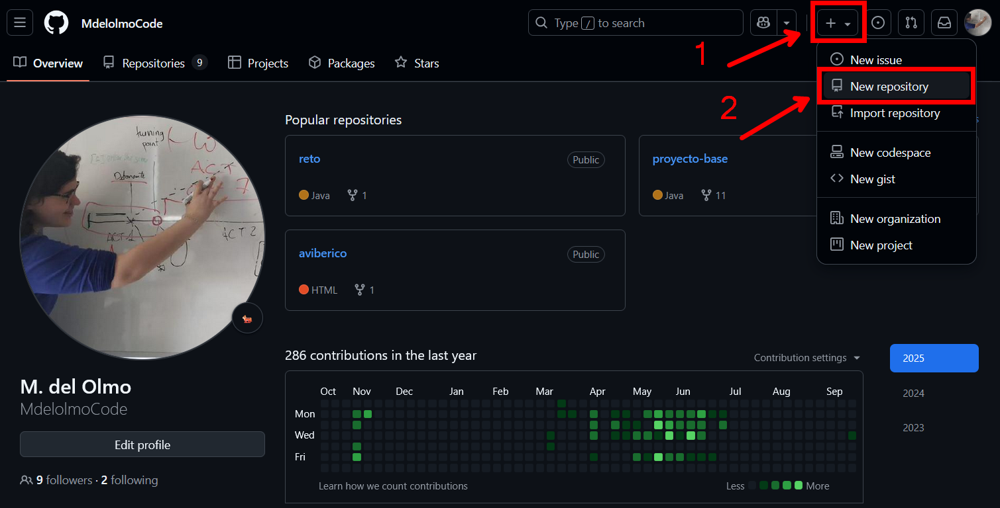

O también se puede hacer click en nuestra foto de perfil y darle a "Repositories" (Repositorios)

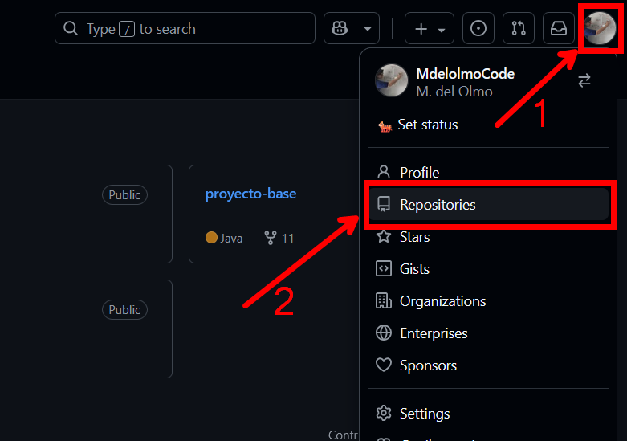

Una vez ahí, se hace Click en "New" (Nuevo)
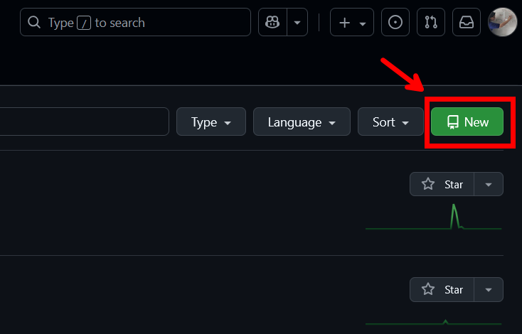

2. Elegimos el nombre de nuestro repositorio. Ten en cuenta que no puedes tener dos repositorios con el mismo nombre. El propio GitHub te avisará si ya existe uno con ese mismo nombre.

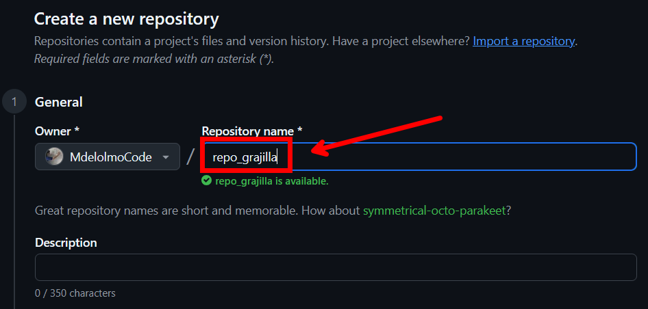

3. Podemos añadir una descripción si lo queremos

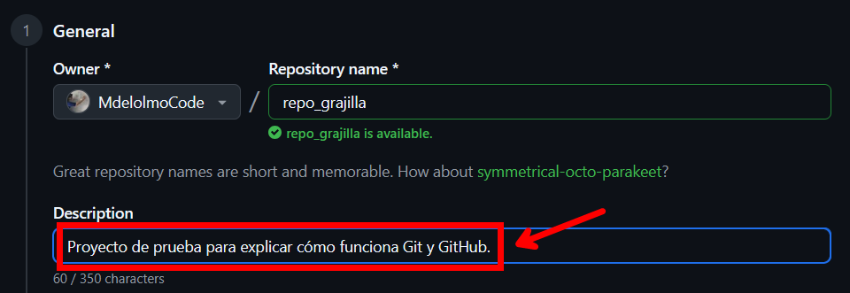

4. Elegimos la visibilidad del repositorio. Si es público lo podrá ver todo el mundo y si es privado sólo lo podremos ver nosotros y quienes elijamos.

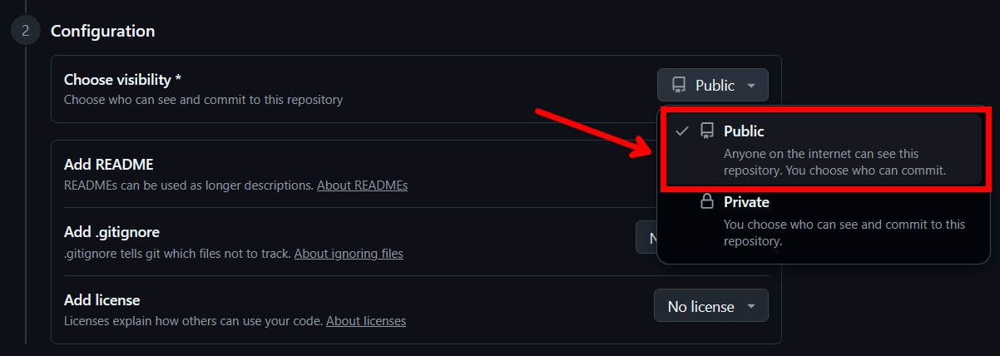

5. Elegir si añadir un archivo README o no

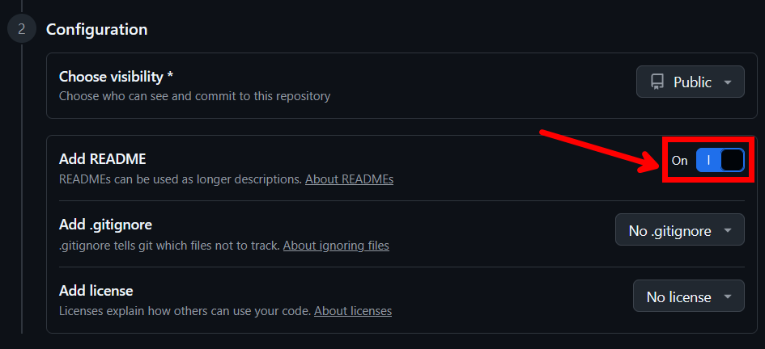

6. Elegir si añadir un archivo .gitignore o no

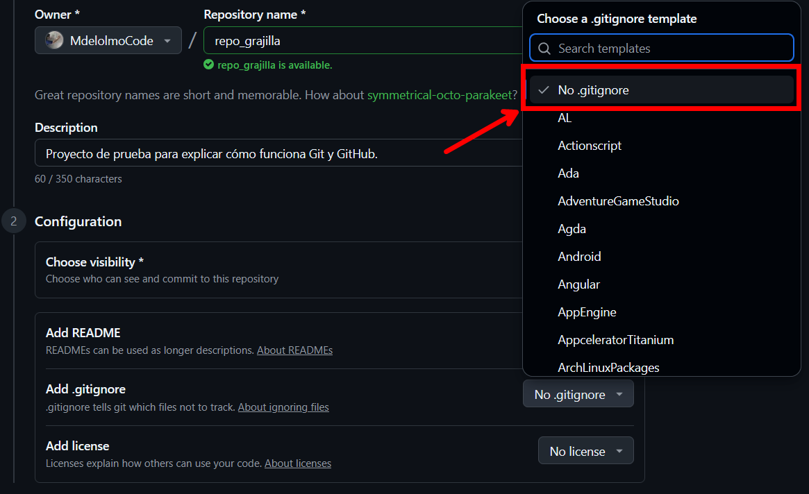

7. Elegimos si añadir licencia o no

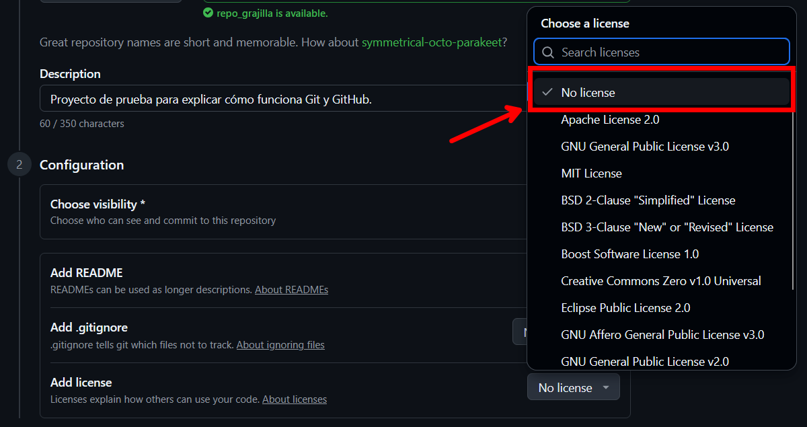

8. Una vez configurado todo, hacemos click en "Create repository" (Crear repositorio)

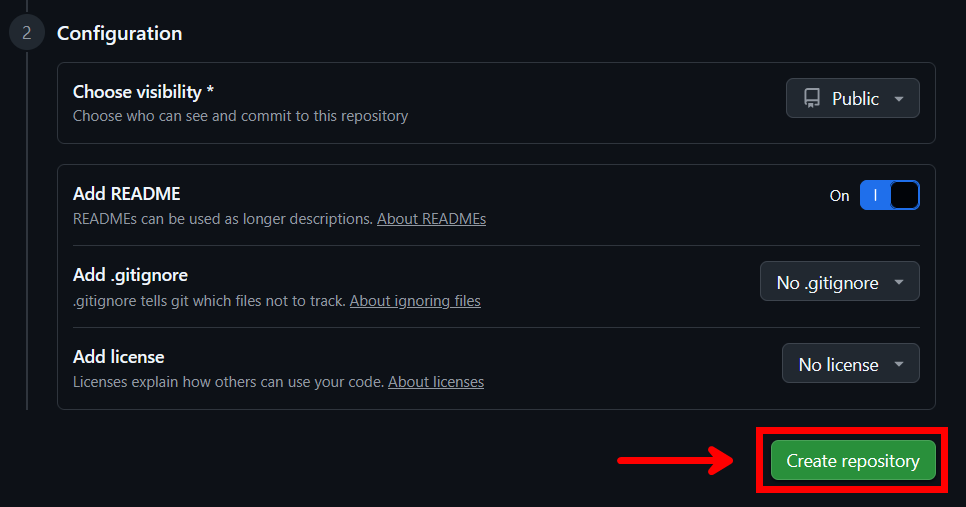

9. Comprobamos que se ha creado el repositorio correctamente

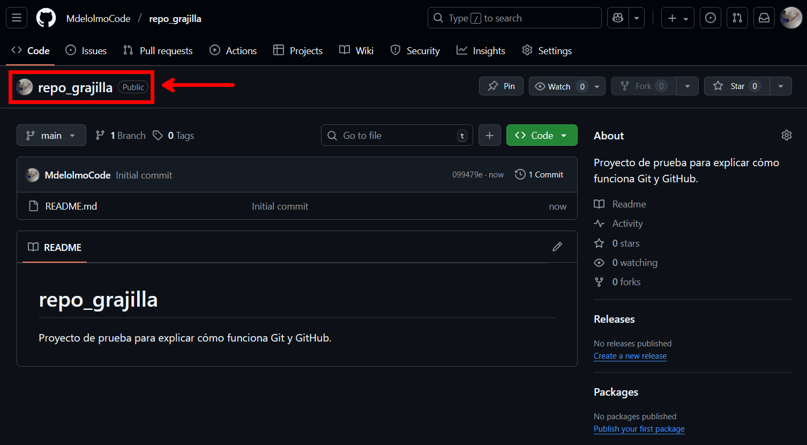

10. Clonar el repositorio en nuestro IDE de preferencia

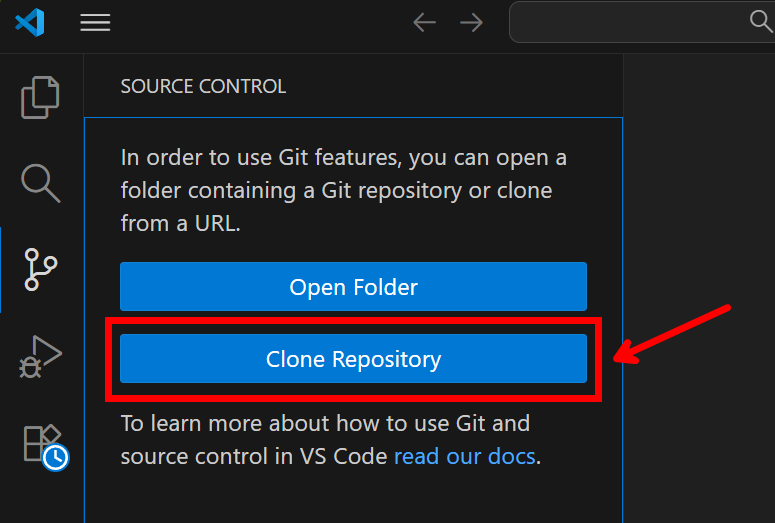

### Cómo eliminar un repositorio desde GitHub

1. Desde el repositorio en GitHub, se hace click en "Settings" (Ajustes)
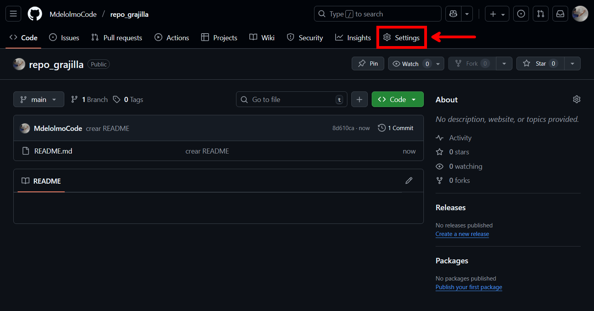

2. En General (la sección por defecto) bajar hasta abajo del todo y en "Danger Zone" (Zona de Peligro), hacer click en "Delete this repository" (Eliminar este repositorio)
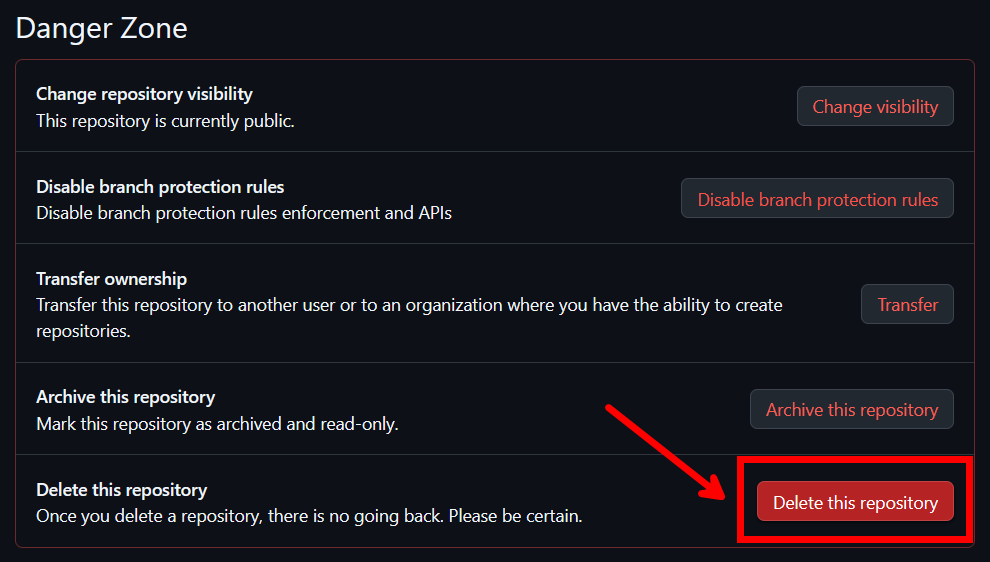

3. Se hace click en "I want to delete this repository" (Quiero eliminar este repositorio)
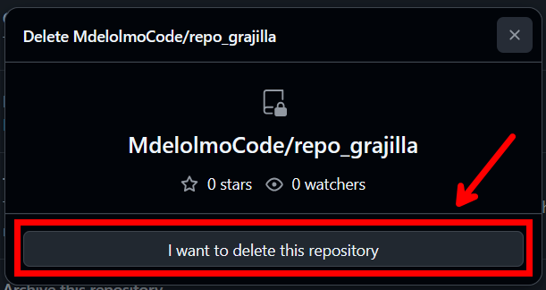

4. Lees los efectos que va a tener y haces click en "I have read and understand this effects" (He leído y entiendo estos efectos)
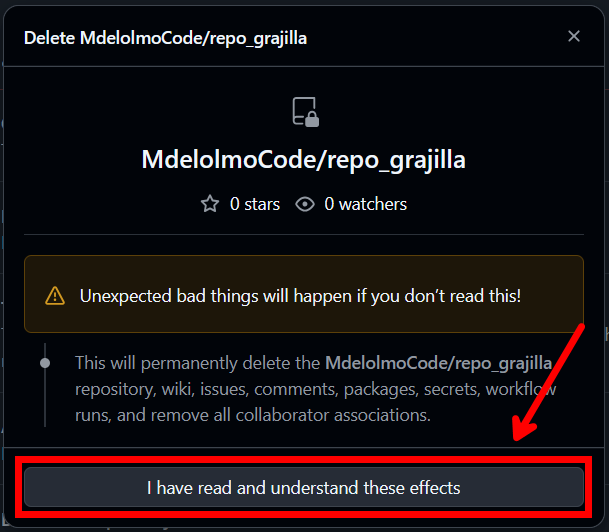

5. Escribes lo que te pida (normalmente es tu nombre de usuario y el nombre del repo o el número de estrellas que tiene tu repo) y haces click en "Delete this repositorio" (Eliminar este repositorio)

6. Comprobamos que se ha eliminado el repositorio correctamente
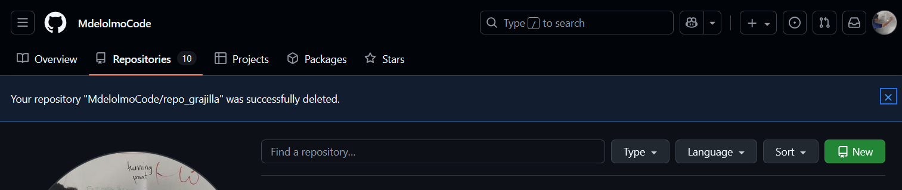